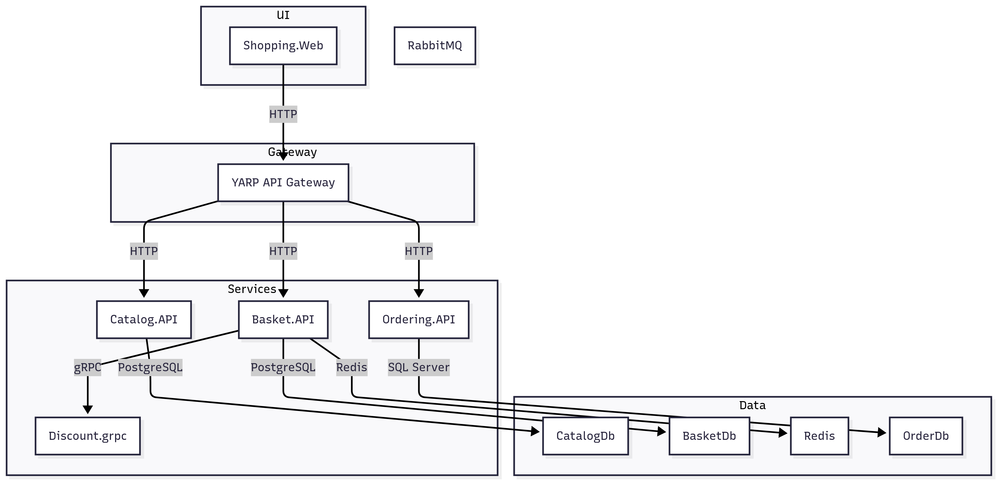

# ECommerce Microservices Solution

## Architecture Overview

This solution is built using a microservices architecture. Each business capability is implemented as an independent service, communicating over HTTP/gRPC and using dedicated data stores. The system is orchestrated and run using Docker Compose.

### Architecture Diagram



## Solution Components

- **WebApps/Shopping.Web**: ASP.NET Core Razor Pages frontend for end users.
- **ApiGateways/YarpApiGateway**: YARP-based API Gateway for routing and aggregation.
- **Services/Catalog/Catalog.API**: Product catalog REST API.
- **Services/Basket/Basket.API**: Shopping cart REST API.
- **Services/Discount/Discount.grpc**: Discount calculation via gRPC.
- **Services/Ordering/Ordering.API**: Order management REST API.
- **Infrastructure**: PostgreSQL (catalog, basket), SQL Server (orders), Redis (cache), RabbitMQ (messaging).

## Key Libraries and Packages

- **Refit.HttpClientFactory**: Type-safe REST API client generation.
- **YARP.ReverseProxy**: API Gateway and reverse proxy.
- **Carter**: Minimal API framework for HTTP APIs.
- **Marten**: Document database/event store for .NET (PostgreSQL).
- **AspNetCore.HealthChecks**: Health check endpoints for services and dependencies.
- **Grpc.AspNetCore**: gRPC server and client support.
- **Microsoft.Extensions.Caching.StackExchangeRedis**: Redis distributed caching.
- **Scrutor**: Assembly scanning and dependency injection.
- **Mapster**: Object mapping.
- **Microsoft.EntityFrameworkCore.Sqlite**: SQLite provider for EF Core (used in Discount service).

## Running the Solution with Docker

1. **Install Docker Desktop** if not already installed.
2. Open a terminal at the solution root.
3. Run:

    ```sh
    docker-compose up --build
    ```

   This will:
   - Build all service images.
   - Start PostgreSQL, SQL Server, Redis, RabbitMQ, and all microservices.
   - Expose web UIs and APIs on the following ports:
     - Shopping Web: http://localhost:6005
     - YARP API Gateway: http://localhost:6004
     - Catalog API: http://localhost:6000
     - Basket API: http://localhost:6001
     - Discount gRPC: http://localhost:6002
     - Ordering API: http://localhost:6003
     - RabbitMQ Management: http://localhost:15672 (user: guest, pass: guest)

4. To stop and remove containers:

    ```sh
    docker-compose down
    ```

---

**Note:** This project uses .NET 8 and C# 12.0. The main user interface is implemented with Razor Pages.
